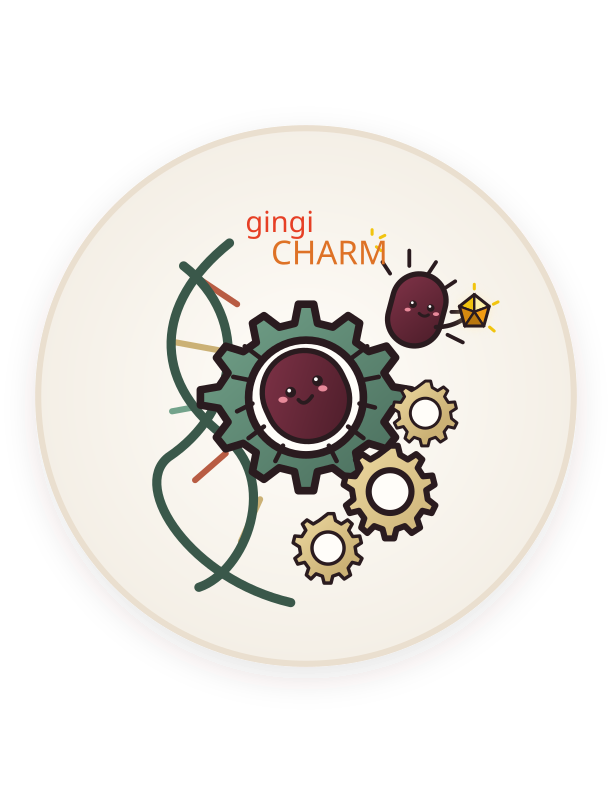
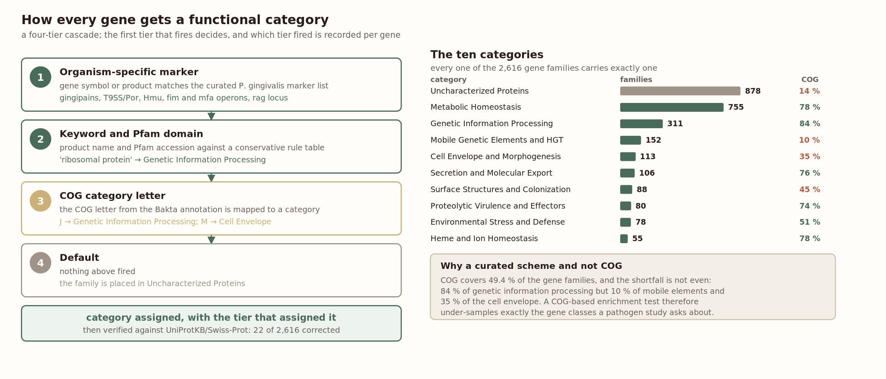

<p align="center">
  
</p>

<h1 align="center">gingiCHARM</h1>

<p align="center">
  <em>P. <strong>gingi</strong>valis <strong>CH</strong>aracterisation, <strong>A</strong>llele typing and <strong>R</strong>eference <strong>M</strong>odule</em>
</p>

<p align="center">
  
  
  
</p>

---

Characterise a *Porphyromonas gingivalis* genome in one pass — virulence
factors, functional categories, and full fimA / mfa-operon / rag / capsular
K-antigen typing — from a single curated reference database.

Sequencing has got cheap enough that oral anaerobes are whole-genome sequenced
routinely. The bioinformatics has not kept up. *E. coli*, the streptococci and
the staphylococci all have dedicated typing servers, and the general typing
platforms inherit their reference sets from those species. *P. gingivalis* is
in none of them. Typing an isolate today means reading several typing
literatures, pulling reference alleles out of papers published between 1998 and
2025, and writing a script per scheme, then repeating it genome by genome.
Most groups skip it.

gingiCHARM makes it one command.

```
fimtyping  my_isolate.fna
# fimA type: I  (100.0% identity, 100.0% coverage of reference)
```

## What it does

| Module | Question it answers |
|---|---|
| `pgvfdb` | which virulence factors does this genome carry? |
| `fimtyping` | what is the fimA fimbrial type (I, Ib, II–V)? |
| `mfatyping` | what is the minor-fimbriae operon profile (mfa1/2/3/4/5)? |
| `ragtyping` | what is the rag type (rag-1 to rag-4)? |
| `kantigen` | what is the capsular K-antigen serotype? |
| `pgfunc` | what functional category does each gene fall into? |
| `pgmlst` | what is the PubMLST seven-locus sequence type? |

Every module reads the same bundled database — 3,001 curated records, plus the
PubMLST allele set used by `pgmlst`. Nothing extra to download.

## Install

Python 3.8 or newer. The first install needs internet access to fetch NCBI
BLAST+, the one external dependency.

```bash
git clone https://github.com/S-Alapati/gingicharm.git
cd gingicharm
bash install.sh
```

This creates an isolated environment, installs the package, downloads BLAST+
and puts the commands on your PATH. Check it worked:

```bash
pgtoolkit-info
```

## Use it

Every command takes one FASTA — assembly, contigs, CDS or predicted proteins:

```bash
fimtyping  my_strain.fna
mfatyping  my_strain.fna
ragtyping  my_strain.fna
kantigen   my_strain.fna
pgvfdb     my_strain.fna -o virulence.tsv
pgfunc     my_strain.fna -o categories.tsv
```

Add `-o file.tsv` for the full table. `--min-identity`, `--min-coverage` and
`--threads` are there if you need them.

From Python:

```python
import mfatyping

result = mfatyping.analyze("my_strain.fna")
print(result.operon_profile)     # ('70A', '70', '70', '70', 'A1')
result.to_tsv("mfa_report.tsv")
```

### Browser interface

```bash
cd web
bash start.sh
```

Opens on <http://127.0.0.1:5057>. Upload one or many genomes, tick the modules
you want, browse the results and download them as TSV.

## What is in the database

Built from five complete *P. gingivalis* genomes — ATCC 33277, W83, TDC60,
A7436 and AJW4 — re-annotated with Bakta and clustered with MMseqs2 at 80 %
identity over 80 % coverage into 2,616 non-redundant gene families, 1,476 of
which are present in all five strains. To that core we added 154 curated
virulence-factor families and the reference alleles for all four typing
schemes.

| Scheme | Types covered | Not yet covered |
|---|---|---|
| fimA | I, Ib, II, III, IV, V | — |
| mfa operon | mfa1: 53 / 70A / 70B · mfa2–4: 53 / 70 · mfa5: A1 A2 B C D E | — |
| rag | rag-1, rag-2, rag-3, rag-4 | — |
| K-antigen | K1, K3, K4, K6, K− | K2, K5, K7 |
| MLST | 220 sequence types, 241 alleles | - |

K2, K5 and K7 are missing because no capsular sequence has ever been deposited
for their reference strains (HG184, HG1690, 34-4).

The MLST module carries the PubMLST seven-locus scheme. Thirty-two sequence
types and seven alleles recovered from public RefSeq assemblies were returned
to PubMLST and defined there, taking the scheme from 177 types to 220.

## Functional categories

Every gene family carries exactly one of ten functional categories, curated for
this organism rather than inherited from a general ontology.



### Why not COG, GO or KEGG

A COG letter is available for 1,292 of the 2,616 gene families, which is
49.4 %. The missing half is the obvious problem; the bigger one is that it is
not missing at random.

| Category | Families | With a COG letter |
|---|---|---|
| Uncharacterized Proteins | 878 | 14 % |
| Metabolic Homeostasis | 755 | 78 % |
| Genetic Information Processing | 311 | 84 % |
| Mobile Genetic Elements & HGT | 152 | 10 % |
| Cell Envelope & Morphogenesis | 113 | 35 % |
| Secretion & Molecular Export | 106 | 76 % |
| Surface Structures & Colonization | 88 | 45 % |
| Proteolytic Virulence & Effectors | 80 | 74 % |
| Environmental Stress & Defense | 78 | 51 % |
| Heme & Ion Homeostasis | 55 | 78 % |

COG covers the housekeeping categories well and the organism-specific ones
badly: 84 % of genetic information processing against 10 % of mobile genetic
elements and 35 % of the cell envelope. That follows from how orthologous
groups are built, since COGs are defined by conservation across distant taxa
and the categories that fall out worst are the lineage-restricted and recently
acquired ones. So a COG-based enrichment test on a *P. gingivalis* experiment
asking about surface structures or horizontally acquired material runs on a
tenth to a half of the relevant genes, and the ones it drops are not a random
sample with respect to the question. The result is biased, not merely
underpowered.

### How a gene is assigned

Four lines of evidence are collected for every family: the COG letter from the
Bakta annotation, the best `blastp` hit against UniProtKB/Swiss-Prot at
e-value ≤ 1e-10, the Bakta product name and Pfam/InterPro domains, and a
curated list of *P. gingivalis* gene and product-name fragments that
unambiguously flag a category.

These feed a four-tier cascade, and the first tier that fires decides. Tier 1
matches the organism-specific marker list, which handles the gingipains, the
T9SS/Por machinery, the Hmu system, the fim and mfa operons and the rag locus.
Tier 2 matches product name and Pfam accession against a conservative rule
table. Tier 3 maps the COG letter. Tier 4 places anything left in
Uncharacterized Proteins. The tier that fired is recorded per family in
`Category_evidence`, so every assignment carries its provenance and you can
filter on how it was made.

Assignments were then checked against Swiss-Prot. Of the disagreements, 97
proved to be systematic naming differences, for instance "UvrABC system protein
C" against "excinuclease UvrC", and were resolved by synonym-aware comparison.
Twenty-two were real mislabels and were corrected: seven named genes (*panC*,
*ompR*, *xthA*, *ompA*, *porG*, *rarA*, PgCG_01627) and fifteen families that
had sat in Uncharacterized Proteins despite unambiguous Swiss-Prot homology.

### Do the categories mean anything

They can be checked against something they were not built from. The pangenome
partition is computed from presence and absence across the five source genomes
and uses no category information, and the categories line up with it: 595 of
755 metabolic families are core, as central metabolism should be; 143 of 152
mobile element families are accessory, as mobile DNA should be; and 360 of 878
uncharacterized families are strain-unique, which is what an unknown residue
should look like if it is holding genuinely unknown material rather than
serving as a dumping ground.

Labelling is not the same as knowing. A third of the genome sits in
Uncharacterized Proteins, and an enrichment result that resolves to that
category is a statement about ignorance. The category exists so the unknown
fraction stays visible and countable instead of being silently dropped before
the test runs.

### Using them

```bash
pgfunc my_strain.fna -o categories.tsv
```

Categories transfer to a query genome by homology to the family reference at
70 % identity over 70 % coverage, so a query gene inherits the category of the
family it matches rather than being re-derived. A gene family absent from all
five source genomes is reported as uncharacterized by default rather than by
evidence, which is a limitation worth remembering when the query is divergent.

## How typing works

Sequence comparison, no PCR step. Each module BLASTs the query against the
reference alleles for its scheme and reports the closest match, ranked by
**identity × coverage** rather than raw bitscore — reference alleles within a
scheme differ a lot in length (the mfa5 genotypes span 3,681 to 6,615 bp) and
bitscore ranking would systematically favour the longest one.

An mfa component with no qualifying hit is reported as `X`, meaning unknown or
missing rather than confirmed deletion: the locus may be genuinely absent, too
divergent for the current panel, or in an incomplete part of the assembly.

## Limitations

- K2, K5 and K7 capsular references are unavailable (see above); strains of
  those serotypes are reported untypeable rather than mis-assigned.
- Strains carrying tandem mfa5-1 + mfa5-2 copies get the single best mfa5 hit,
  not both. An assembly-aware extension is planned.
- The rag locus is divergent enough that annotation misses *ragA* in the rag-4
  group; those calls rest on *ragB* and are flagged as ragB-supported.
- Calibrated for *P. gingivalis*. Confirm species identity before typing —
  a *P. gulae* genome will produce confusing calls.

## Repository layout

```
gingicharm/
├── install.sh, install.py    one-step installer
├── pyproject.toml
├── src/                      the Python package
│   ├── pgcore/               shared BLAST layer + bundled database
│   ├── pgvfdb/  fimtyping/  mfatyping/
│   ├── ragtyping/ kantigen/ pgfunc/
│   └── pgmlst/               PubMLST scheme, bundled separately
├── validation/               database and typing validation scripts
├── web/                      Flask browser interface
└── assets/                   logo and figures
```

The package is distributed under the module name `pgtoolkit`; gingiCHARM is
the product name. The console commands and Python imports use the module
names shown above.

## Citing

If gingiCHARM is useful in your work, please cite it. A `CITATION.cff` is
included, and GitHub will render a "Cite this repository" button from it.
The accompanying paper is in preparation — this section will be updated with
the citation once it is published.

## Licence

MIT — see [LICENSE](LICENSE).
